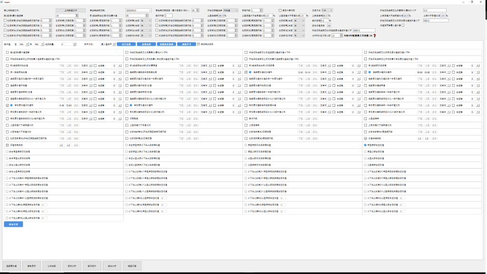
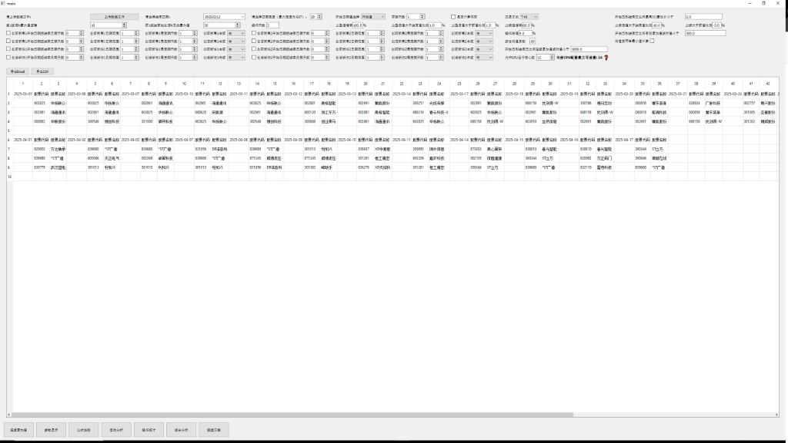
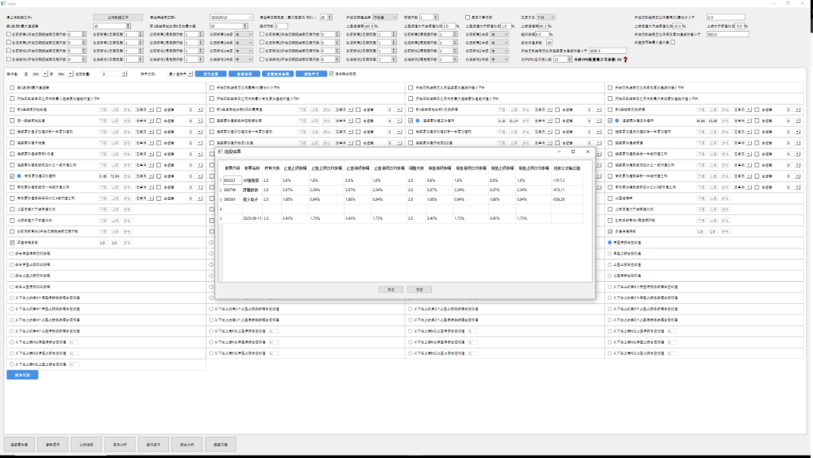
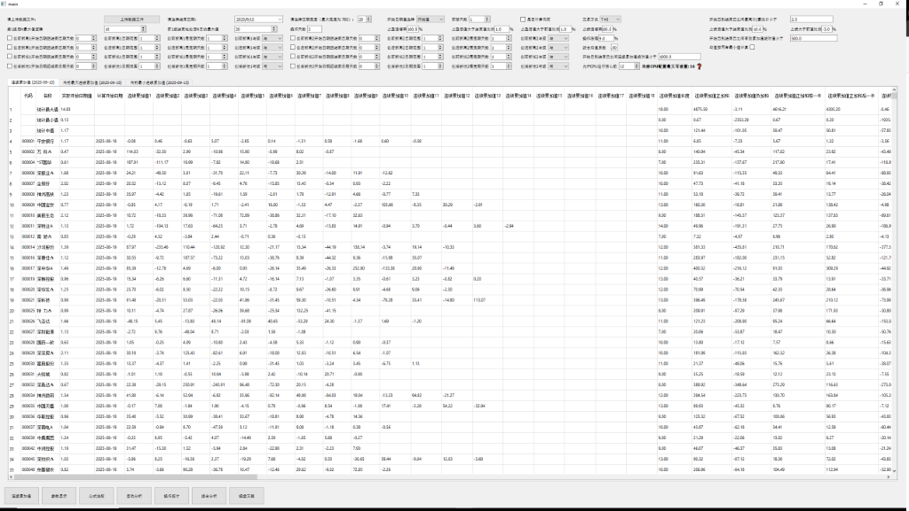
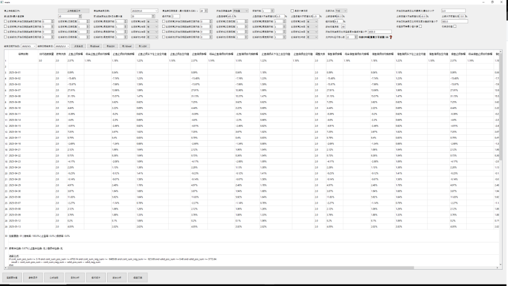

# 量化选股分析系统项目概述

本系统是一个高性能的桌面端量化分析工具，专为处理大规模股票数据而设计。系统采用 **Python + Cython** 混合架构，在保持开发效率和界面交互灵活性的同时，利用 C++ 级别的运算速度实现复杂的量化计算。

> [!IMPORTANT]
> **启动方式**: 请直接运行项目根目录下的 `main.exe` 程序即可启动本系统。
> 
> [!WARNING]
> **保密声明**: 由于本项目牵涉保密协议，仅展示不涉及保密的部分。**测试用的数据文件**以及**后续实盘交易功能**均属于保密内容，故当前项目未提供数据文件。您可以参考本文档及下方截图查看系统的实际运行效果。

## 1. 技术架构

系统采用了分层设计，将界面逻辑与核心计算分离，以确保在处理大量数据时界面的响应速度。

*   **界面层与业务逻辑 (Python)**: 
    *   使用 **PyQt5** 构建现代化的图形用户界面 (GUI)，提供文件上传、参数配置、数据展示和交互式图表。
    *   负责文件 I/O 处理（支持 Excel/CSV），数据清洗与预处理。
    *   管理多线程/多进程任务调度，确保 UI 不卡顿。
*   **核心计算层 (Cython)**:
    *   为了突破 Python GIL（全局解释器锁）的限制并最大限度利用 CPU 性能，核心数学运算模块 `worker_threads_cy` 采用 **Cython** 编写并编译为原生扩展。
    *   利用 OpenMP 实现并行计算，充分发挥多核 CPU 的优势。

## 2. 核心选股流程

系统工作流模拟了量化研究的标准过程，支持从基础筛选到深度组合分析。

### 2.1 基础参数计算
用户上传包含股票历史价格的数据文件后，系统会自动计算一系列关键量化指标。
*   **基础指标**: 如区间最大值、最小值、起始/结束值、涨跌幅、振幅等。
*   **高级指标**: 连续上涨/下跌天数、累加涨跌幅、有效波段统计等。

### 2.2 条件选股
基于计算出的参数，用户可以设置过滤条件进行初步筛选。例如，筛选出"过去N天内最大涨幅超过X%"或"连续下跌不超过Y天"的股票。

## 3. 组合公式与参数扫描

系统最强大的功能在于其灵活的**组合公式分析**能力。用户不再局限于单一的参数，而是可以编写复杂的逻辑表达式，并对参数进行扫描分析。

*   **参数范围与步长**: 对任意数值型参数（如阈值、比例），用户可以设定 `[下限, 上限]` 及 `步长`。
*   **动态组合**: 系统会自动遍历所有参数组合，针对每一种组合运行选股逻辑。
*   **公式引擎**: 支持自定义 Python 风格的表达式（如 `if (A > 10 and B < 5): ...`），实现高度定制化的策略。

## 4. 极致的性能表现

针对量化分析中常见的大数据量和高计算密度痛点，本系统进行了深度优化：

*   **数据规模**: 支持同时处理 **5000+ 支股票**，时间跨度可达 **450 个交易日**（或更长）的高频或日线数据。
*   **复杂度**: 支持 **10 个以上的变长参数**同时进行组合分析。
*   **性能指标**: 在上述负载下，系统经过优化（Cython + 多进程并行），**每个策略组合**可在 **10秒以内** 完成运算。对于多策略组合分析，总耗时为 `N * 10s`（N为组合数量）。

## 5. 结果可视化与导出

计算结果以直观的表格形式展示，支持：
*   **多维排序**: 点击表头即可对任意指标进行排序。
*   **详细数据查看**: 双击行可查看该股票的详细历史数据和指标变化曲线。
*   **结果导出**: 支持将选股结果导出为 Excel/CSV，便于进一步回测或实盘导入。

